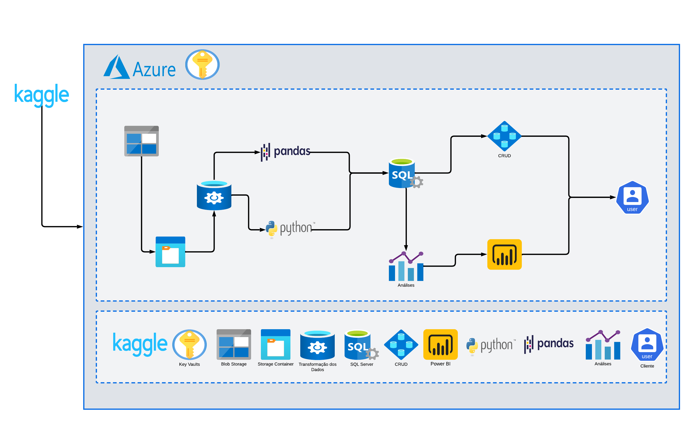

# Detecção De Fraude - BlueShiftAcademy

O projeto será estruturado em etapas claras, abrangendo desde a compreensão dos dados até o desenvolvimento e implantação. O foco está em:

Compreensão dos Dados: Explorar e entender os dados históricos de transações disponíveis.

Identificação de Padrões: Analisar o comportamento dos clientes para identificar desvios em padrões de gastos que possam indicar fraudes.

Modelagem com Aprendizado de Máquina: Aplicar técnicas de aprendizado de máquina para criar um modelo preditivo capaz de identificar possíveis fraudes com precisão.

## Tecnologias Utilizadas

- **Kaggle** - Plataforma para Busca de Dados
- **Azure** - Armazenamento Na Nuvem Ultilizando o BlobStorage
- **Python** - Tratamento de Dados
- **SQLServer** - Banco de dados relacional utilizado por padrão
- **GitHub** - Versionamento Do Projeto
- **Power B.I** - Dashboard

- ## Arquitetura do Projeto

Abaixo está a representação da arquitetura utilizada neste projeto:

