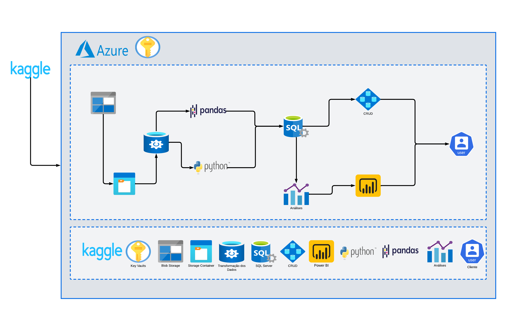
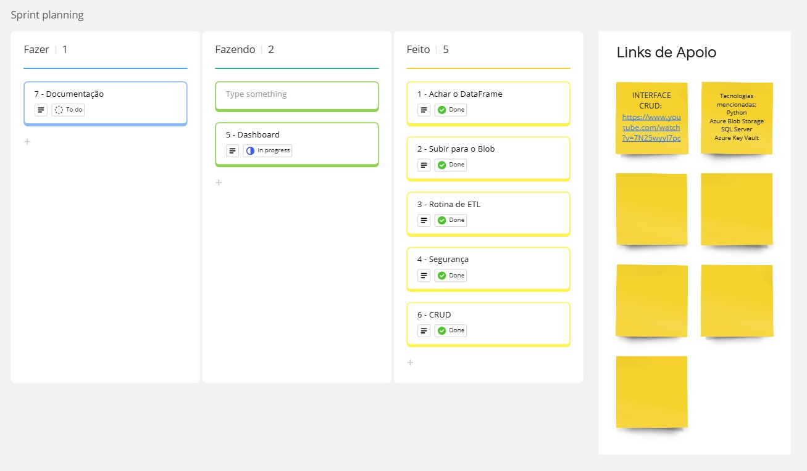
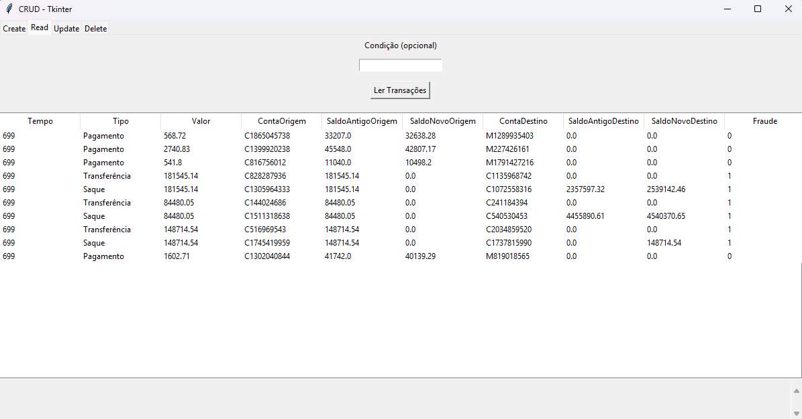
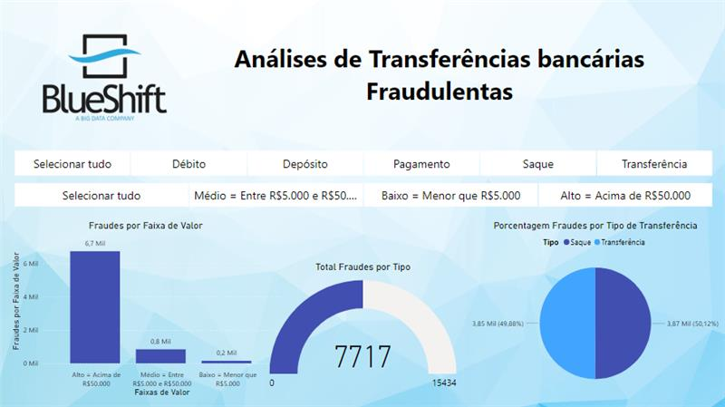

# 🚨 Detecção de Fraude em Transações Bancárias - BlueShiftAcademy

Este projeto apresenta uma solução robusta para detectar fraudes em transações bancárias de aplicativos de pagamento móvel. Ele utiliza manipulação de dados e visualização para proteger clientes contra atividades fraudulentas e reduzir prejuízos financeiros.

---

## 🎯 **Objetivo**

O objetivo deste projeto é desenvolver uma solução eficiente e confiável para a **detecção de fraudes em transações bancárias**, utilizando:

- **Análise de padrões de comportamento financeiro** para identificar anomalias.
- **Automatização da detecção de anomalias em tempo real**, garantindo segurança nas operações.
- **Dashboards interativos** para visualização e tomada de decisão.
- Tecnologias modernas como Python, SQL Server, Azure e Power BI, criando um sistema escalável e seguro.

A entrega final incluirá:
1. Interface gráfica para manipulação de transações (CRUD).
2. Modelo preditivo para detectar fraudes.
3. Dashboard interativo para análise de resultados.

---

## 📊 **Arquitetura do Projeto**

A arquitetura do projeto consiste em uma série de serviços interconectados para garantir a escalabilidade e segurança da solução. Abaixo, a imagem ilustra a estrutura geral da arquitetura:



### **Componentes Principais:**  
- **Fonte de Dados:** Dataset do Kaggle contendo informações sobre transações financeiras.  
- **Azure Blob Storage:** Armazenamento seguro e eficiente para arquivos.  
- **Azure Key Vault:** Gerenciamento seguro das credenciais de acesso aos serviços Azure.  
- **SQL Server:** Banco de dados para armazenar e consultar os dados processados.  
- **Python (Pandas):** Processamento dos dados e carga no banco de dados SQL Server.  
- **Power BI:** Criação de dashboards interativos para análise visual das fraudes.

---

## 🗂️ **Etapas do Projeto**

1. **Compreensão dos Dados**: Exploração dos dados históricos de transações.
2. **Identificação de Padrões**: Análise de comportamento financeiro para identificar anomalias.
3. **Modelagem com Aprendizado de Máquina**: Treinamento de um modelo para prever possíveis fraudes.
4. **Implantação**: Integração do modelo com APIs e tecnologias na nuvem.

---

## 🛠️ **Tecnologias Utilizadas**

- **Kaggle**: Fonte de datasets para análise.
- **Miro**: Planejamento e organização do fluxo do projeto.
- **Azure Blob Storage**: Armazenamento de arquivos na nuvem.
- **SQL Server**: Banco de dados relacional.
- **Python**: Processamento e análise de dados.
- **Power BI**: Dashboards interativos.
- **GitHub**: Gerenciamento de código e versionamento.

---

## 📋 **Requisitos do Sistema**

### **Funcionais**
- Permitir a criação de transações financeiras no banco de dados, com os seguintes campos:
  - Tempo da transação.
  - Tipo de transação (transferência, saque, depósito, etc.).
  - Valor envolvido.
  - Contas de origem e destino.
  - Saldos antes e depois da transação.
  - Indicador de fraude (Sim/Não).
- Realizar a leitura de registros do banco de dados com filtros personalizados e exibição em tabela.
- Atualizar informações de transações específicas com base em critérios fornecidos.
- Excluir transações financeiras armazenadas no banco de dados.
- Automatizar o processo de autenticação de credenciais com Azure Key Vault.
- Exibir um histórico de até 10 transações mais recentes ao inicializar o sistema.
- Identificar transações com indícios de fraude.

### **Não Funcionais**
- Conexão segura ao banco de dados SQL Server hospedado no Azure.
- Gerenciamento de credenciais exclusivamente via Azure Key Vault.
- Interface gráfica simples e intuitiva desenvolvida com Tkinter.
- Garantia de operações em tempo hábil, mantendo alta usabilidade.
- Uso de bibliotecas confiáveis e suportadas:
  - `pyodbc`, `sqlalchemy` para conexão com o banco de dados.
  - `azure.identity`, `azure.keyvault.secrets` para autenticação no Azure.
  - `tkinter` para a interface gráfica.

### **Requisitos de Infraestrutura**
- Acesso ao Azure Blob Storage para manipulação de arquivos.
- Ambiente configurado para execução de notebooks Jupyter com as seguintes dependências:
  - `pandas`, `sqlalchemy`, `pyodbc`, `azure-identity`, `azure-storage-blob`.
- Banco de dados SQL Server no Azure com a tabela necessária:
  - Tabela principal: `dbo.projeto_daniel_danillo_matheus`.

### **Requisitos de Segurança**
- Credenciais (servidor, usuário e senha) não devem ser armazenadas em texto plano.
- A autenticação no Azure Key Vault deve ser configurada com segurança utilizando `DefaultAzureCredential`.
- Proteção contra injeção de SQL, validando todas as entradas dos usuários.

---

## 📋 **Metodologia Ágil**

Adotamos a Metodologia Ágil para gerenciar as atividades, utilizando um quadro kanban para organizar as tarefas. O fluxo é dividido em:

### Sprint Planning:
- **Fazer**: Planejamento de tarefas futuras, como documentação e criação de dashboards.
- **Fazendo**: Tarefas atualmente em desenvolvimento.
- **Feito**: Atividades concluídas, incluindo pipelines de ETL e integração de segurança.



---

## 🖥️ **Demonstração Prática do Sistema**

### 📋 **Interface Gráfica (CRUD)**
A interface permite:
- **Inserção de transações financeiras**: Adicionar novas transações ao banco.
- **Atualização e exclusão de registros**: Modificar ou excluir dados.
- **Exibição de histórico recente**: Mostrar as 10 transações mais recentes ao inicializar.

#### Exemplo da Interface CRUD:


---

### 📊 **Dashboard Interativo**
Criado no Power BI, o dashboard apresenta:
- **Padrões de comportamento dos clientes**: Identificar hábitos financeiros.
- **Detecção de fraudes**: Destaque de transações suspeitas pelo modelo preditivo.

#### Exemplo do Dashboard:


---

## 🚀 **Como Configurar o Projeto**

1. Clone este repositório:
   ```bash
   git clone https://github.com/DanielsOfficial0102/FraudDetection-BlueShiftAcademy.git
